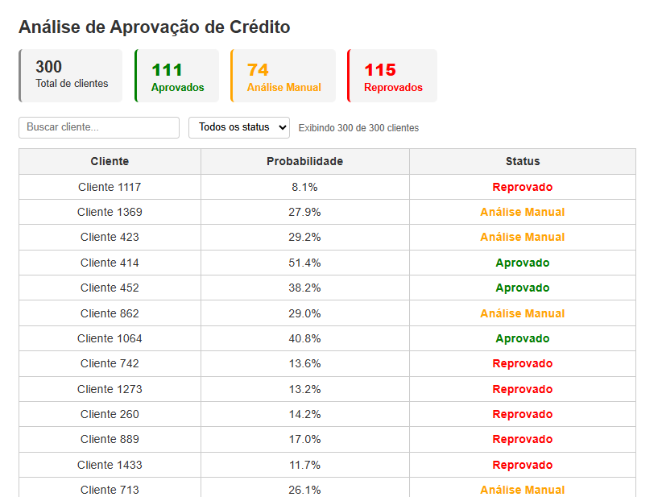

# 💳 Análise de Aprovação de Crédito com Modelos Bayesianos

Projeto de **análise e previsão de aprovação de crédito** utilizando **Aprendizado Bayesiano**, com geração de dados sintéticos, baseline probabilístico, regressão logística bayesiana, API de inferência e interface web integrada.

---

## 🎯 Objetivo do Projeto

Demonstrar, de forma prática, como **Modelos Bayesianos** podem ser utilizados para:

- Estimar **probabilidades reais de aprovação de crédito**
- Quantificar **incerteza**
- Interpretar estatisticamente o impacto das variáveis
- Disponibilizar previsões via **API REST**
- Visualizar decisões em uma **interface web**

---

## 🧠 Por que Bayes?

- Probabilidades reais ao invés de scores arbitrários  
- Intervalos de credibilidade (HDI)  
- Tomada de decisão baseada em incerteza  
- Padrão utilizado em motores reais de crédito  

---

## 🧪 Modelos Implementados

### 1️⃣ Naive Bayes (Baseline)
- Linha de base probabilística  
- Rápido e interpretável  

### 2️⃣ Regressão Logística Bayesiana (PyMC)
- Inferência MCMC com NUTS  
- Estima distribuições de parâmetros  
- Gera probabilidades calibradas  

---

## 🏗️ Arquitetura

```bash
analise-credito-aprendizado-bayesiano/
├── api/
│   ├── main.py
│   └── static/index.html
├── assets/
├── data/ (gitignored)
├── models/ (gitignored)
│   ├── bayesian_credit_trace.nc
│   └── scaler.joblib
├── results/ (gitignored)
├── src/
│   ├── generate_data.py
│   ├── pipeline.py
│   ├── preprocess.py
│   ├── naive_bayes.py
│   ├── bayesian_logistic.py
│   ├── evaluate_models.py
│   ├── inference.py
│   ├── interpretation/
│   │   └── coefficients.py
│   └── utils/
│       ├── save_results.py
│       └── save_trace.py
├── main.py
└── requirements.txt
```

---

## ⚙️ Por que Python 3.10?

- Melhor desempenho  
- Melhor gerenciamento de memória  
- Compatibilidade com PyMC, NumPy, sklearn e ArviZ  

---

## 🔄 Pipeline Automatizado

```bash
python main.py
```

O pipeline:

1. Gera dados sintéticos  
2. Pré-processa dados (split → fit scaler no treino → transform no teste)  
3. Treina modelos (Naive Bayes + Regressão Logística Bayesiana)  
4. Exibe diagnósticos de convergência MCMC (R-hat, ESS, divergências)  
5. Avalia modelos (accuracy + ROC-AUC)  
6. Persiste modelo bayesiano e scaler  
7. Salva métricas e coeficientes  

---

## 🧠 Como acontece o treinamento de Machine Learning

O treinamento neste projeto ocorre de forma **offline e totalmente automatizada**, seguindo um pipeline de engenharia de Machine Learning semelhante ao utilizado em sistemas reais de análise de crédito.

### 1️⃣ Geração dos dados

O processo inicia com a **geração de um dataset sintético realista**, simulando atributos comuns em decisões de crédito, como:

- Idade  
- Renda mensal  
- Score de crédito  
- Valor solicitado  
- Taxa de endividamento  
- Histórico de inadimplência  

Esses dados são gerados por distribuições estatísticas calibradas, permitindo simular cenários reais de concessão de crédito.

### 2️⃣ Construção do rótulo (aprovação)

A variável alvo (`aprovado_credito`) não é aleatória.  
Ela é calculada por uma **função logística de risco**, que combina as variáveis de entrada e gera uma **probabilidade real de aprovação**.

Essa probabilidade é utilizada para gerar o rótulo final de forma estocástica, simulando decisões reais de crédito.

### 3️⃣ Pré-processamento

Antes do treinamento, os dados passam por:

- Separação em treino e teste **antes** da normalização (evita data leakage)  
- Normalização com `StandardScaler` fitado **somente** no conjunto de treino  
- Scaler persistido em `models/scaler.joblib` para inferência futura com dados novos  

### 4️⃣ Treinamento dos modelos

Dois modelos são treinados:

- **Naive Bayes** como baseline probabilístico  
- **Regressão Logística Bayesiana** como modelo principal  

O modelo bayesiano é treinado via **MCMC com NUTS (No-U-Turn Sampler)**, estimando distribuições completas dos parâmetros ao invés de apenas valores pontuais.

### 5️⃣ Persistência do modelo

Após o treinamento, dois artefatos são salvos em disco:

- **`models/bayesian_credit_trace.nc`** — posterior bayesiano completo em formato NetCDF  
- **`models/scaler.joblib`** — scaler treinado, necessário para normalizar dados novos com os mesmos parâmetros

Esses artefatos são carregados pela API para inferência sem necessidade de retreinamento.

### 6️⃣ Inferência em produção

A API apenas carrega o modelo salvo e utiliza os parâmetros médios das distribuições para calcular **probabilidades individuais de aprovação de crédito**, sem necessidade de retreinamento.

Isso separa claramente:

- Fase de treinamento (offline)  
- Fase de decisão (online)  

---

## 🌐 API de Inferência

Após o treino:

```bash
python -m uvicorn api.main:app --reload
```
---

## 🖥️ Interface Web

Acesse:

```bash
http://127.0.0.1:8000/ui
```

A interface consome a API e exibe:

- **Cards de resumo** com total de clientes e contagem por status  
- **Campo de busca** por nome do cliente  
- **Filtro por status** (Aprovado / Análise Manual / Reprovado)  
- **Tabela completa** com probabilidade de aprovação e status de cada cliente  
- Contador dinâmico indicando quantos registros estão sendo exibidos

---

## 🖼️ Demonstração

| Faixa de Probabilidade | Status do Crédito   | Interpretação |
|-----------------------|---------------------|---------------|
| ≥ 0.35                | Aprovado            | Cliente com bom perfil de risco |
| 0.25 – 0.34           | Análise Manual      | Cliente com risco intermediário |
| < 0.25                | Reprovado           | Cliente com alto risco de inadimplência |



---

## 📈 Interpretação Bayesiana

Coeficientes do modelo analisados por HDI 95% (última execução do pipeline).  
Features cujo intervalo **não cruza zero** têm efeito consistente e confiável sobre a decisão.

| Feature                   | Mean   | HDI 2.5% | HDI 97.5% | Efeito         |
|---------------------------|--------|----------|-----------|----------------|
| score_credito             | +0.421 | +0.278   | +0.578    | ✅ Positivo    |
| renda_mensal              | +0.179 | +0.055   | +0.295    | ✅ Positivo    |
| historico_inadimplencia   | -0.520 | -0.693   | -0.384    | ❌ Negativo    |
| taxa_endividamento        | -0.257 | -0.368   | -0.122    | ❌ Negativo    |
| valor_solicitado          | -0.229 | -0.345   | -0.095    | ❌ Negativo    |
| idade                     | +0.030 | -0.109   | +0.167    | ➖ Inconclusivo |

---

## 🧩 Conceitos Demonstrados

- Inferência Bayesiana  
- MCMC / NUTS  
- Regressão logística bayesiana  
- Engenharia de pipelines  
- APIs de inferência  
- Visualização de score de crédito  
- Arquitetura de motores de risco  
